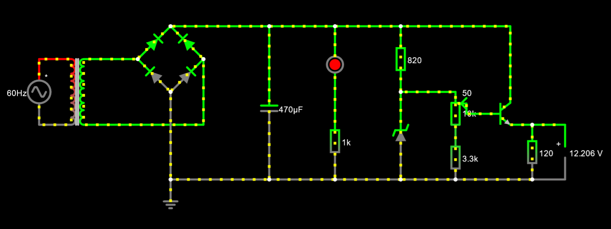
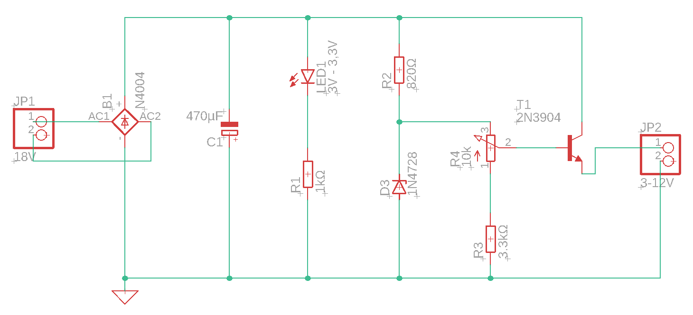
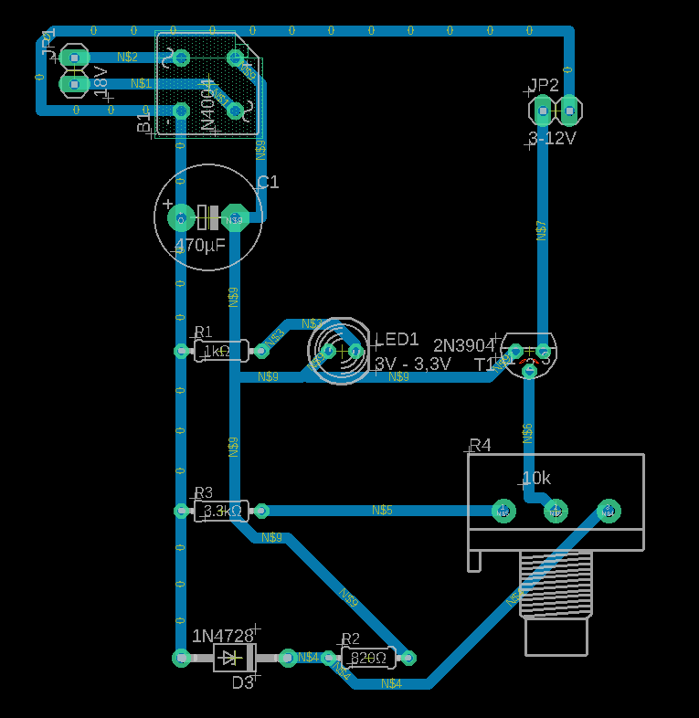

# Trabalho 1: Fonte de tensão variável

Projeto realizado no primeiro semestre do curso de Bacharelado em Ciências de Computação, para a disciplina '[SSC0180] – Eletrônica para Computação', ministrada pelo professor Eduardo do Valle Simões, da USP de São Carlos.

# Alunos - Grupo 51

| **Nome Completo**                                         | **N°USP** |
| --------------------------------------------------------- | --------- |
| [Gustavo Vieira Ferreira](https://github.com/uspgus)      | 13672690  |
| João Pedro Mori Machado                                   | 13671831  |
| Jorge Luiz Franco                                         | 13695091  |
| [Murilo Valentim Zabott](https://github.com/murilozabott) | 13672807  |

# Objetivo

Construir em uma placa _protoboard_ um circuito que tenha como entrada uma corrente alternada de 127V de tensão e intensidade de corrente elevada, que tenha como saída uma corrente entre 3 e 12V de tensão e intensidade de corrente de 100mA.

# Diagrama da Fonte

[Link do circuito no Falstad](https://tinyurl.com/27879qlg)

# Escolha de Componentes

| Quantidade | Componente      | Especificações            | Valor   |
| ---------- | --------------- | ------------------------- | ------- |
| 1          | Transformador   | Trafo Bivolt 18+18v 500mA | R$41,90 |
| 1          | Ponte de Diodos | Ponte Retificadora KBP206 | R$7,38  |
| 1          | Capacitor       | 680µF, 25V                | R$2,50  |
| 1          | LED             | Vermelho 1.8V - 15mA      | R$0,25  |
| 1          | Diodo Zener     | 1N4743A [13V / 1W]        | R$0,50  |
| 1          | Potenciômetro   | 10kΩ                      | R$4,75  |
| 1          | Resistor 820    | 820Ω +/-5%, 2W            | R$0,70  |
| 1          | Resistor 1k     | 1000Ω +/-5%, 1W           | R$0,70  |
| 1          | Resistor 3.3k   | 3300Ω +/-5%, 2W           | R$0,70  |
| Total      |                 |                           | R$59,38 |

# Projeto no Software Eagle

# :heavy_division_sign: Cálculos

Primeiro é necessário calcular a razão entre a tensão RMS da fonte e o transformador.

Esse valor é usado nas definições do simulador Falstad

Depois é calculada a tensão de pico do circuito, , dessa tensão são retirados 1.4V, dado que em cada ciclo ocorre a passagem por 2 diodos. 

Em seguida deve-se calcular a capacitância necessária para a filtragem do circuito, que pode ser obtida pela seguinte fórmula:

- Io - Corrente de saída
- Vs - Tensão de pico após a ponte de diodos
- f - frequência da fonte, no caso 60hz

Para a obtenção da corrente, são somadas a corrente no led, no diodo zener e na saída do carregador.

- Para a corrente do led, usamos a Lei de Ohm, subtraindo 3.1 (queda aproximada no led) da tensão de pico e dividindo pelo resistor

- A corrente no Zener também é obtida pela Lei de Ohm, são subtraidos 13V (breakthrough voltage) e é feita a divisão pelo resistor. O resistor do Zener foi obtido simulando o circuito no Falstad e ajustando os valores entre resistores comerciais até obter um sistema capaz de atender as especificações.

- Por definição, Ic deve ser de 100mA

Dado que este não é um valor comercial de capacitores, na fonte foi usado um capacitor de 470µF.

# Vídeos

[Funcionamento da fonte](https://youtu.be/yn_xcfaXrXw)
